# 실시간 센서 데이터 모니터링 및 원격 제어 플랫폼

**8채널 센서 수집부터 C 연산, Python 서버, 웹 대시보드까지 직접 설계하고 구현한 프로젝트입니다.**

센서 데이터를 채널당 100kS/s로 수집·처리하고 연산 결과를 웹 대시보드에 실시간으로 표시합니다. 브라우저에서 처리 파라미터와 보정 계수를 바꾸면 서버가 장비에 반영합니다.

이 저장소는 프로젝트의 설계 과정과 구현 화면을 정리한 공개 포트폴리오입니다.

## 프로젝트 개요

| 항목 | 내용 |
| --- | --- |
| 목표 | 8채널 센서 데이터를 실시간으로 처리하고 웹에서 모니터링·제어 |
| 담당 범위 | C 수집·연산 엔진, Python API·전송 계층, 웹 UI, 배포·운영 자동화 단독 설계 및 구현 |
| 장비 환경 | AD4858 ADC, ZedBoard, Kuiper Linux |
| 데이터 흐름 | 센서 → C 수집·연산 → Python 프레임 파싱·JSON 변환 → WebSocket → 웹 대시보드 |
| 제어 흐름 | 웹 UI → REST API → Python → 처리 파라미터·보정 계수 반영 |
| 처리량 개선 | 개발 당시 측정 자료 기준 평균 69 → 349.8 kS/s/ch, 약 5배 개선 |

위 처리량은 개발 당시 측정 결과로, 첨부한 포트폴리오 슬라이드에 기록했습니다. 브라우저에는 필터링과 시간평균을 거친 데이터를 전달하며, 센서 수집 속도와 웹 화면의 갱신 속도는 구분됩니다.

## 설계 판단과 시스템 구조

### 수집·연산과 웹 전송의 역할 분리

Python 중심 구조에서 센서 데이터를 읽고 연산하는 과정에 병목이 발생했습니다. 읽기와 연산을 C로 옮기고, Python에는 프레임 파싱·API·웹 전송 역할을 배치했습니다. 처리량과 운영 요구를 기준으로 각 계층의 기술을 선택했습니다.

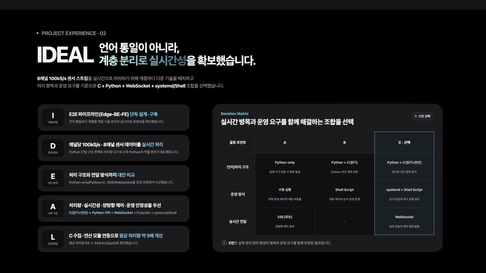

### 데이터 전달과 제어 경로

C는 센서 데이터를 수집해 필터링·평균화·보정 연산을 수행합니다. Python은 C의 연산 결과 프레임을 파싱하고 JSON으로 직렬화한 뒤 WebSocket으로 브라우저에 전달합니다.

REST API로 제어 요청을 받습니다. 보정 계수는 실행 중인 C 프로세스에 전달합니다. 주요 수집·처리 파라미터를 바꿀 때는 파이프라인을 재시작해 설정을 반영하며 Pydantic으로 요청의 구조와 타입을 검증합니다.

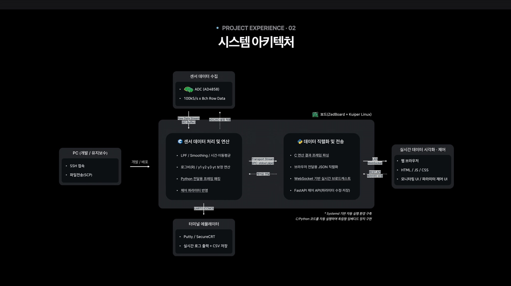

### 기여 범위 및 구축 결과

C 수집·연산, Python API·WebSocket, 웹 대시보드, 배포·운영 자동화를 직접 구현했습니다. 데이터 확인과 설정 변경을 한 화면에 연결했습니다. 장비 상태를 보면서 설정을 바꾸고 제어할 수 있습니다.

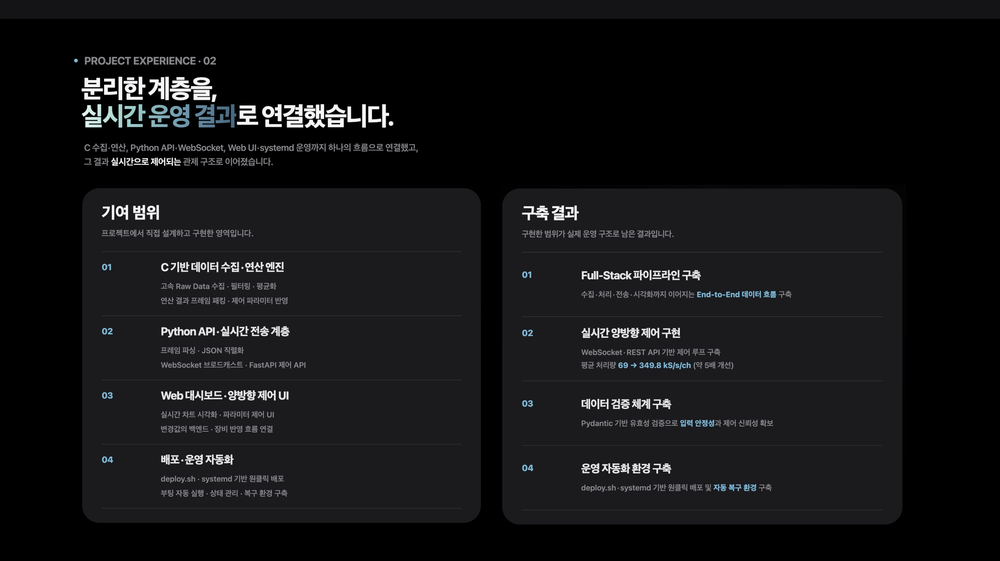

## 주요 구현 내용

| 영역 | 구현 내용 |
| --- | --- |
| 센서 수집·연산 | libiio로 8채널 데이터를 수집하고 LPF, 이동평균, 시간평균, 로그비·보정 연산 수행 |
| 데이터 전송 | C의 출력 프레임을 Python에서 파싱하고 JSON으로 변환해 WebSocket으로 전송 |
| 원격 제어 | REST API로 파라미터·보정 계수를 변경하고 Pydantic으로 요청 구조와 타입 검증 |
| 웹 대시보드 | 채널별 시계열과 처리 단계 표시, 확대·축소, 차트 초기화, CSV 저장·다운로드 |
| 배포·운영 | Shell Script로 전송·빌드·서비스 재시작을 자동화하고 systemd로 부팅 시 실행과 프로세스 종료 후 재시작 구성 |

Chart.js의 표시 데이터 수를 제한하고 애니메이션을 비활성화하여 화면 갱신 부담을 줄였습니다. 모니터링할 때는 웹 차트와 UART0 로그를 함께 확인하도록 했습니다.

## 사용 기술

| 계층 | 기술 | 적용 목적 |
| --- | --- | --- |
| 센서 수집·연산 | C, libiio | 센서 데이터 수집, 필터링·평균화·보정 연산 |
| API·데이터 처리 | Python, FastAPI, Uvicorn, Pydantic, NumPy | 프레임 파싱, JSON 변환, 요청 검증, 제어 API |
| 실시간 전송 | WebSocket | 연산 결과를 브라우저에 지속적으로 전달 |
| 웹 UI | JavaScript, HTML, CSS, Chart.js | 시계열 시각화와 처리 파라미터·보정 계수 조정 |
| 배포·운영 | Linux, systemd, Shell Script, SSH, SCP | 장비 배포, 서비스 실행·재시작, 원격 유지보수 |

## DSP 처리 흐름

수집한 센서 데이터는 필터링과 평균화를 거쳐 보정 연산에 사용됩니다. 처리 단계별 결과는 프레임으로 묶어 Python에 전달합니다. 웹에서는 각 단계와 최종 채널 값을 확인할 수 있습니다.

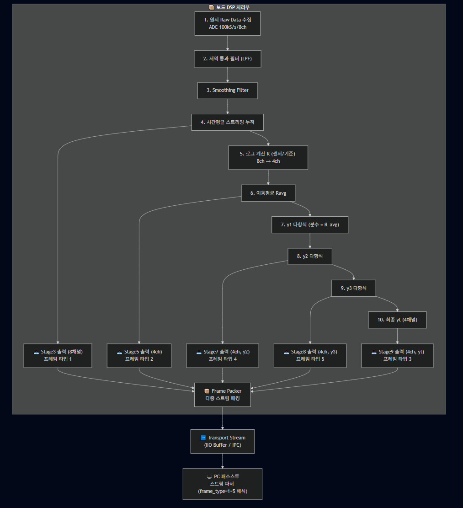

## 모니터링 화면

### 채널별 데이터와 처리 결과

Raw Data 화면은 처리 단계별 센서 데이터를, 4ch 화면은 최종 채널 값을 표시합니다. 채널을 선택하고 차트를 확대·축소하거나 축 범위를 조정할 수 있습니다.

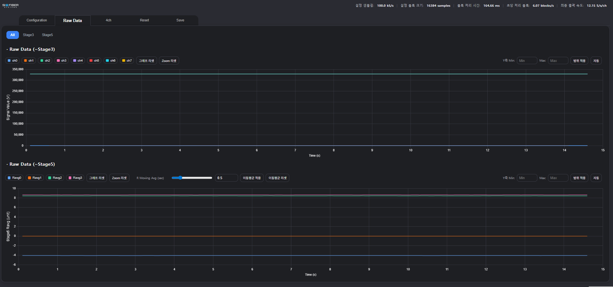

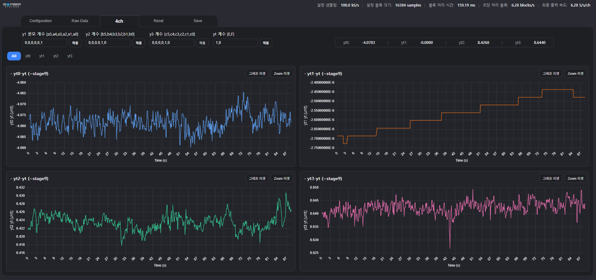

개별 채널 상세 화면

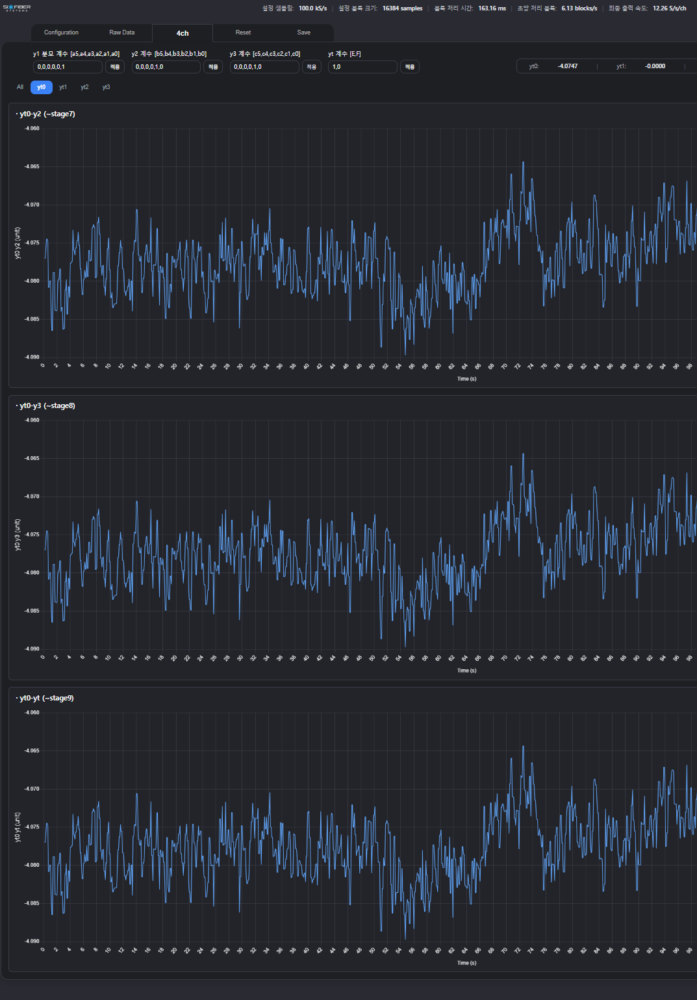

### 파라미터 설정

Configuration 화면에서 샘플링 속도와 평균화 등 처리 설정을 변경하고, 현재 설정을 확인할 수 있습니다. 설정 변경과 현재 상태를 한 화면에 표시해 장비 제어와 모니터링을 함께 할 수 있도록 했습니다.

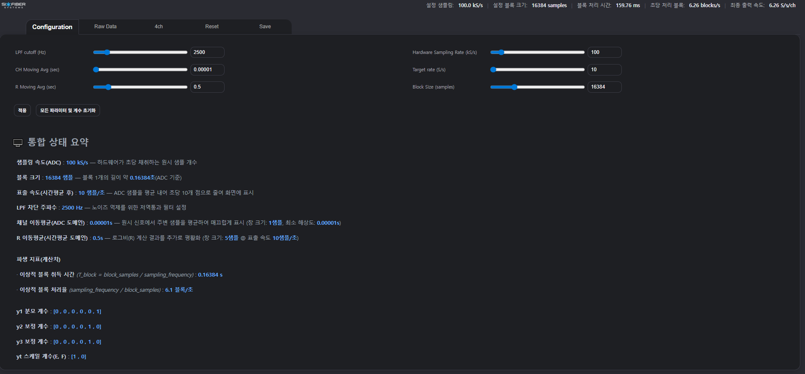

차트 초기화와 데이터 저장 화면

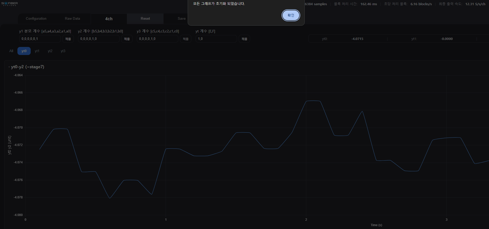

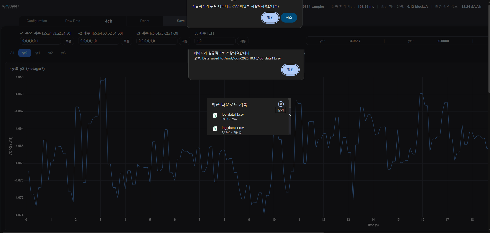

### UART0 로그 확인

웹 화면의 채널 값과 UART0 터미널 로그를 동시에 확인하며 장비의 출력 상태를 점검했습니다.

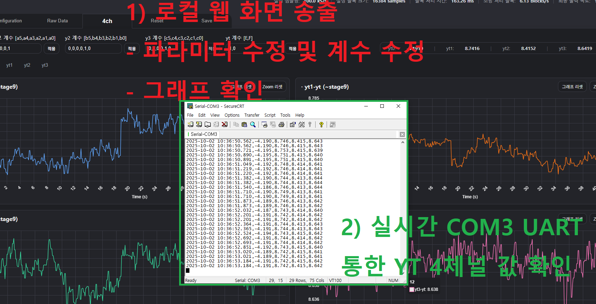

## 화면별 상세 안내

Raw Data — 처리 단계와 그래프 조작

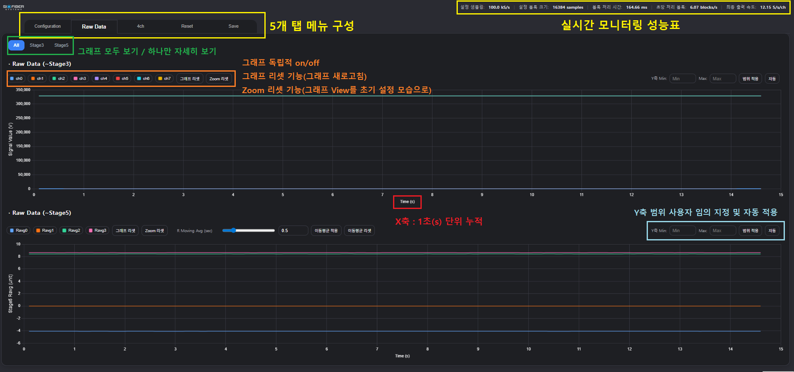

Configuration — 처리 파라미터와 현재 설정

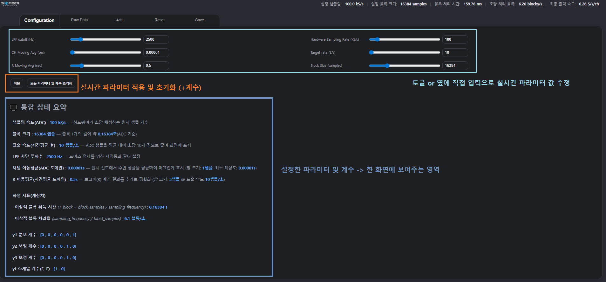

4ch — 보정 계수와 최종 채널 값

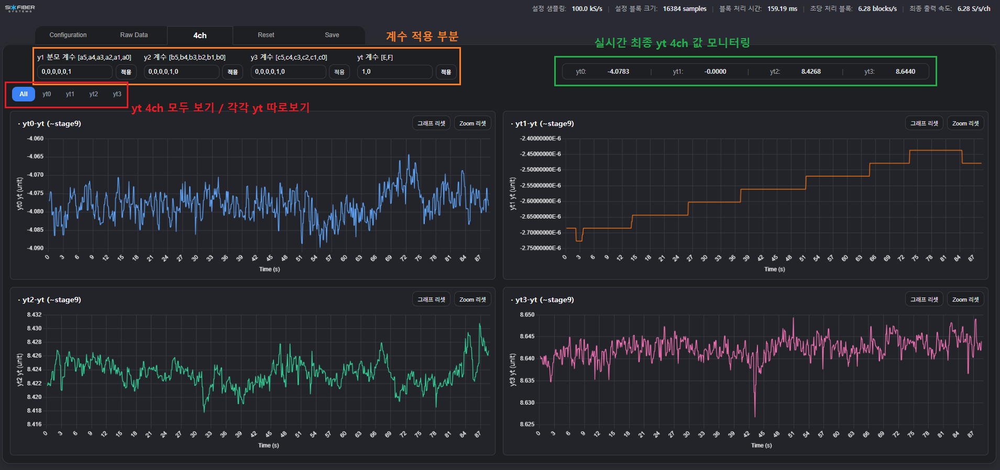

개별 채널 — 세부 연산 결과

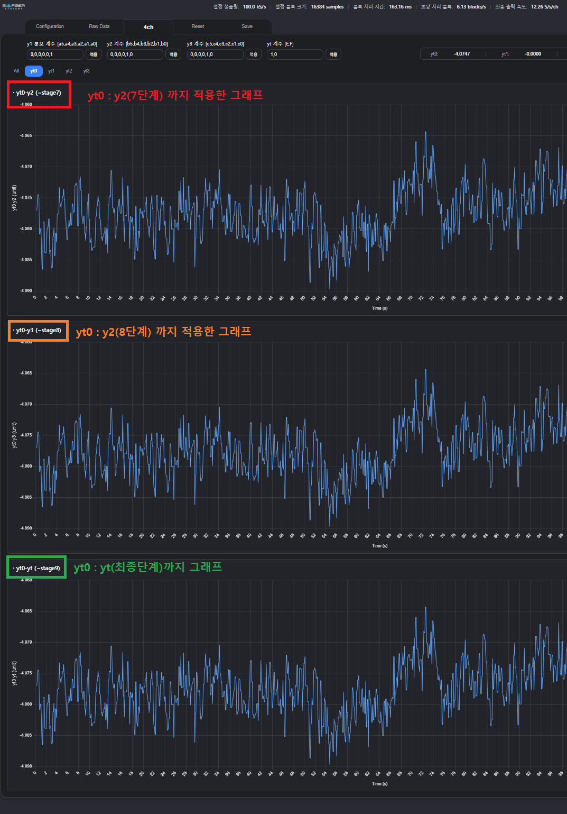

Reset — 차트 초기화

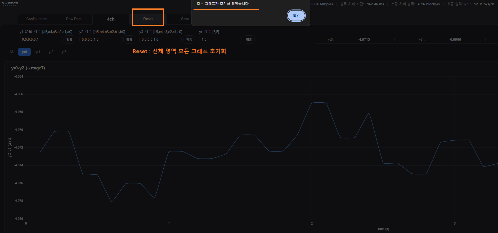

Save — CSV 저장과 다운로드

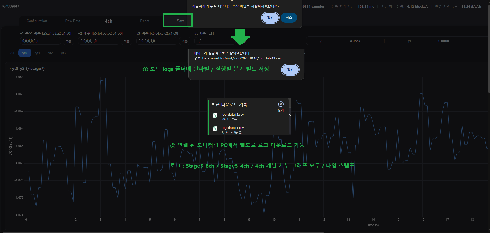

